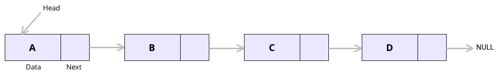

## Definition:

- A linked list consists of nodes where each node contains a data field and a reference(link) to the next node in the list.

- The first and last node are called head and tail. Traversal starts from head until tail is encountered which points to NULL.

   
  

 

## Advantages:

- Data and reference is stored in a non-contiguous manner. This makes insertion, deletion efficient.

- Implementation of data structures like queue and dequeue using linked list is simple.

- Sorting array using merge sort requires O(n) extra space while sorting linked list requires O(1) space.
