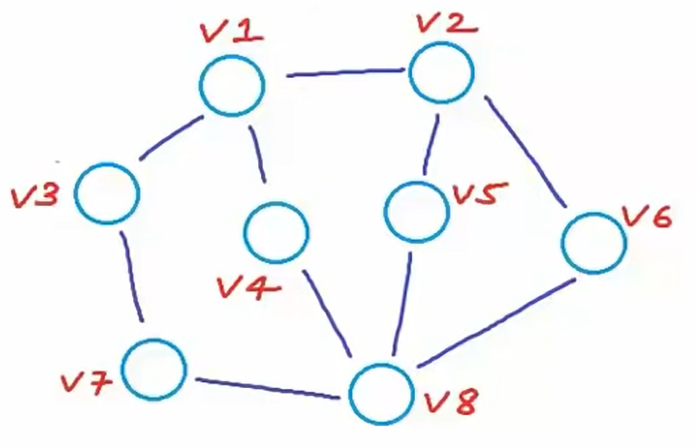

## Graph

- **Definition:** <i>A Graph <b>G</b> is an <b>ordered pair</b> of a set <b>V</b> of vertices and a set <b>E</b> of edges.</i> `G = (V,E)`
   

  - Ordered pair is pair of objects where order matter `(v,e) != (e,v) if (a != b)`
  - Ordered pair are written under paranthesis `()`
  - In our graph definition, first object is always set of vertices and second object is set of edges
  - An unordered pair (denoted by `{}`) is a pair of objects where order does not matter `{a,b} = {b,a}`
     

- **Example:** Given a graph with 8 vertices and 10 edges
   
  

  
  

  - Each node in a graph must have an identification (name index etc)
  - This naming is not indicative of any order. We can give any name to any node
  - Set of vertices V = {v1, v2, v3, v4, v5, v6, v7, v8}
  - Set of edges E = {{v1,v2}, {v1,v3}, {v1,v4}, {v2,v5}, {v2,v6}, {v3,v7}, {v4,v8}, {v5,v8}, {v6,v8}, {v7,v8}}
  - This is an example of undirected graph
