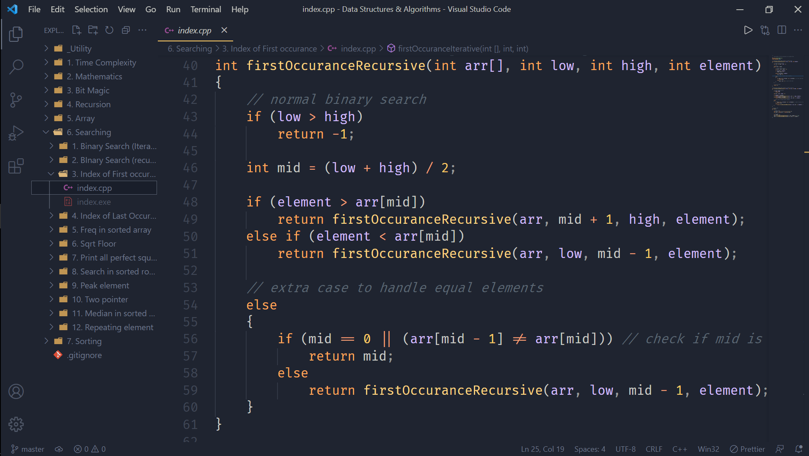

# Data Structures & Algorithms

 

## About the repository:

- Contains theories and programming questions related to fundamentals of data structures and algorithms
- Every topic is in sequence and has a separate folder.
- Within each folder, there are various sub-folders with theory and questions related to that topic
- All codes are written in C++ programming language

 

## Want to contribute ?

- If you found any typo / logical error / runtime error or you want to add another topic, feel free to create a pull request.

- **How to create a pull request ?**

  - step 1: &nbsp; Fork this repository
  - step 2: &nbsp; Clone this to your local machine
  - step 3: &nbsp; Make a new branch
  - step 4: &nbsp; Make changes
  - step 5: &nbsp; Push it back to your repo
  - step 6: &nbsp; Click compare and pull request
  - step 7: &nbsp; Click create pull request

- **Are there any rules ?**

  - Nothing strict, just keep the indentation clean
  - Use comments wherever necessary
  - Follow folder and file structure
  - Use appropriate variable names

 

## Folder structure example:

 

